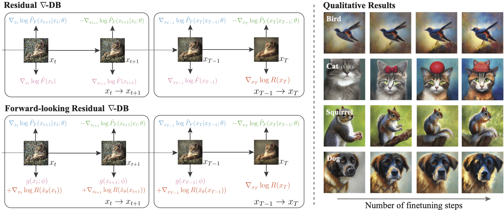

# Nabla-GFlowNet: Efficient Diversity-Preserving Diffusion Alignment via Gradient-Informed GFlowNets


<div align="center">
  
</div>

## Introduction

This is the official implementation of [Nabla-GFlowNet](https://arxiv.org/abs/2412.07775) (ICLR 2025).

Nabla-GFlowNet is an efficient reward finetuning method for diffusion model that better preserves sample diversity and prior knowledge in the pretrained model.


## Getting Started

### Requirements

- Python >= 3.8
- CUDA 12.1
- Pytorch
- diffusers
- peft
- wandb
- ml_collections
- openai-clip
- image-reward
- Some other minor libraries

### Pretrained Models

We use StableDiffusion v1.5 ("runwayml/stable-diffusion-v1-5") but you are free to change this by modifying `pretrained.model` in `config/default_config.py`.

## Finetuning

### Setting Paths

Modify `config/default_config.py` and replace all `"PLACEHOLDER"` strings to the desired values, including logging path, checkpoing saving path and wandb-related values (if you are using Weights & Bias for logging).

### Finetuning

Suppose that you aim to finetune StableDiffusion on a 8-GPU A100 node. To run one of our settings in the paper:

```
torchrun --standalone --nproc_per_node=8 train_nablagfn.py \
  --config=config/aesthetic.py \
  --seed=0 \
  --config.model.reward_scale=1e4 \
  --config.sampling.low_var_subsampling=True \
  --config.model.unet_reg_scale=2e3 \
  --exp_name=default
```

Modify the config file to `config/hpsv2.py` or `config/imagereward.py` if you are to finetune on HPSv2 or ImageReward reward model, respectively.

For faster convergence (in terms of wall clock time) and less memory consumption (potentially runnable on RTX 4090 / V100 / L40; for much less memory consumption, see the last setting), try the following (possibly with slight degradation in prior preservation)

```
torchrun --standalone --nproc_per_node=8 train_nablagfn.py \
  --config=config/aesthetic.py \
  --seed=0 \
  --config.model.reward_scale=1e4 \
  --config.model.unet_reg_scale=2e3 \
  --config.sampling.low_var_subsampling=True \
  --config.model.timestep_fraction=0.1 \
  --config.training.gradient_accumulation_steps=1 \
  --config.sampling.batch_size=4 \
  --config.sampling.num_batches_per_epoch=1 \
  --config.training.num_epochs=400 \
  --exp_name=fast
```

To try the above setting with fewer GPUs (e.g., 2 GPUs), you may try:

```
torchrun --standalone --nproc_per_node=2 train_nablagfn.py \
  --config=config/aesthetic.py \
  --seed=0 \
  --config.model.reward_scale=1e4 \
  --config.model.unet_reg_scale=2e3 \
  --config.sampling.low_var_subsampling=True \
  --config.model.timestep_fraction=0.1 \
  --config.training.gradient_accumulation_steps=4 \
  --config.sampling.batch_size=4 \
  --config.sampling.num_batches_per_epoch=4 \
  --config.training.num_epochs=400 \
  --exp_name=fewer_gpus
```

To save more GPU memory (at the cost of worse sample diversity and prior preservation), you may finetune the diffusion model with the forward loss only (see paper) and at the same time assuming that the guessed gradient is accurate (so no need for learning a U-Net for correction). To do this, run


```
torchrun --standalone --nproc_per_node=2 train_nablagfn.py \
  --config=config/aesthetic.py \
  --seed=0 \
  --config.model.reward_scale=1e4 \
  --config.model.unet_reg_scale=2e3 \
  --config.sampling.low_var_subsampling=True \
  --config.model.timestep_fraction=0.1 \
  --config.training.gradient_accumulation_steps=4 \
  --config.sampling.batch_size=4 \
  --config.sampling.num_batches_per_epoch=4 \
  --config.training.num_epochs=400 \
  --config.model.no_flow=True \
  --exp_name=fewer_gpus_no_flow_correction
```

### Parameters to tune

For different reward models, you may tune the following factors:

- Reward Scale (`config.model.reward_scale`): How biased the finetuned model is towards the reward model. Higher values lead to faster reward convergence and higher reward at convergence, but at the cost of worse prior preservation and worse sample diversity.
- Prior Strength (`config.model.pretrained_strength`, between 0 and 1): Controlling the strength of the prior and thus the relative strength compared to the reward model (but without sharpening the reward). Default is `1.0`.
- Subsampling Rate (`config.model.timestep_fraction`, between 0 and 1): How many transitions to use in a trajectory. Using a full trajectory is optimal in theory, but it is very slow. We set it to `0.1` for 50-step DDPM sampling, but `0.4` for 20-step SDE-DPM-Solver sampling.
- Sampler (`config.sampling.scheduler`, value in `['ddim', 'dpm-solver']`): We currently support DDIM / DDPM (basically DDIM with `eta=1.0`) and SDE-DPM-Solver++.
- Number of Inference Steps (`config.sampling.num_steps`): How many steps to sample images. We used 50 for DDPM and 20 for SDE-DPM-Solver++.
- U-Net L2 Regularization (`config.model.unet_reg_scale`): To control the magnitude of updates with respect to the model at the previous iteration (like in TRPO and PPO). Basically a Fisher divergence. The value should vary depending on if you see the L2 regularization loss spikes up during finetuning. If yes, you should set it to a higher value.
- Optimizer: In our paper we use AdamW with `beta1=0.9` and `beta2=0.999`. But we empirically found that setting `beta2=0.95` (which is kind of common in RL) leads to stabler optimization, potentially even without a strong U-Net regularization. You may try other optimizers like LION.
- Learning Rate: You may slightly lower the learning rate to values like `3e-4` or `1e-4` if you find the finetuning process highly unstable.


### Other Remarks

We found that using float32 for reward model computation (plus its gradients) is important, as using bfloat16 may lead to high numerical errors.

## Citation
If you find our work useful to your research, please consider citing:

```
@InProceedings{liu2025nablagfn,
  title={Efficient Diversity-Preserving Diffusion Alignment via Gradient-Informed GFlowNets},
  author={Liu, Zhen and Xiao, Tim Z and and Liu, Weiyang and Bengio, Yoshua and Zhang, Dinghuai},
  booktitle={ICLR},
  year={2025}
}
```

## Acknowledgement
This repo is adapted from [https://github.com/zdhNarsil/diffusion-alignment](https://github.com/zdhNarsil/diffusion-alignment).


